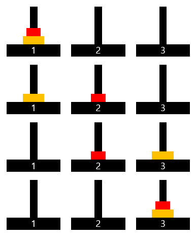
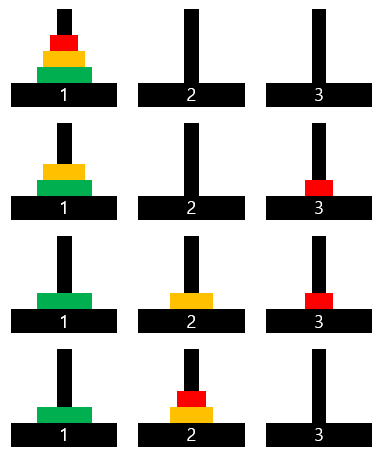
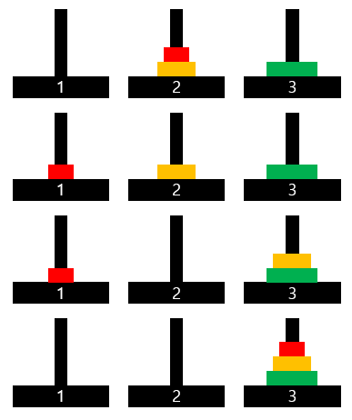

# 1주차 문제2 - 하노이의 탑

|구분|값|
|---|---|
|난이도|2|
|점수|2|
|출처|https://programmers.co.kr/learn/courses/30/lessons/12946|

## 문제 설명
하노이 탑(Tower of Hanoi)은 퍼즐의 일종입니다. 세 개의 기둥과 이 기동에 꽂을 수 있는 크기가 다양한 원판들이 있고, 퍼즐을 시작하기 전에는 한 기둥에 원판들이 작은 것이 위에 있도록 순서대로 쌓여 있습니다. 게임의 목적은 다음 두 가지 조건을 만족시키면서, 한 기둥에 꽂힌 원판들을 그 순서 그대로 다른 기둥으로 옮겨서 다시 쌓는 것입니다.

1. 한 번에 하나의 원판만 옮길 수 있습니다.
2. 큰 원판이 작은 원판 위에 있어서는 안됩니다.

하노이 탑의 세 개의 기둥을 왼쪽 부터 1번, 2번, 3번이라고 하겠습니다. 1번에는 n개의 원판이 있고 이 n개의 원판을 3번 원판으로 최소 횟수로 옮기는 방법을 구하는 프로그램을 만드려고 합니다.

1번 기둥에 있는 원판의 개수 `n`이 주어질 때, 거쳐간 기둥 번호의 합을 출력하는 프로그램을 만들어주세요. (단, 맨 처음 1번 기둥에 있는 상태는 포함하지 않는다.)

## 제한 사항
- 1 ≤ n ≤ 15

## 입력
첫째 줄에 원판의 갯수 n이 주어집니다.

## 출력
첫째 줄에 거쳐간 기둥 번호의 합을 출력다.

## 예시
### 예시1
**입력**

```
2
```

**출력**
```
8
```

**설명**



가장 작은 원판부터 A, B라고 할 때

|원판|출발|도착|
|---|---|---|
|A|1|2|
|B|1|3|
|A|1|3|

즉, 2, 3, 3번 기둥을 거쳐갔으므로 이들의 합인 8

### 예시2
**입력**

```
3
```

**출력**
```
17
```

**설명**





가장 작은 원판부터 A, B, C라고 할 때

|원판|출발||
|---|---|---|
|A|1|3|
|B|1|2|
|A|3|2|
|C|1|3|
|A|2|1|
|B|2|3|
|A|1|3|

즉, 3, 2, 2, 3, 1, 3, 3번 기둥을 거쳐갔으므로 이들의 합인 17
