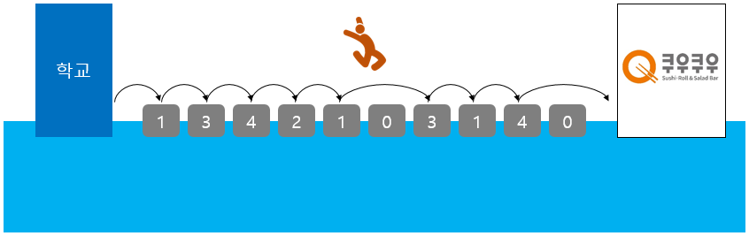
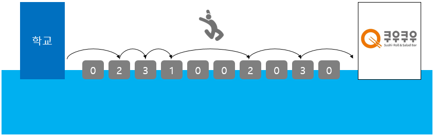
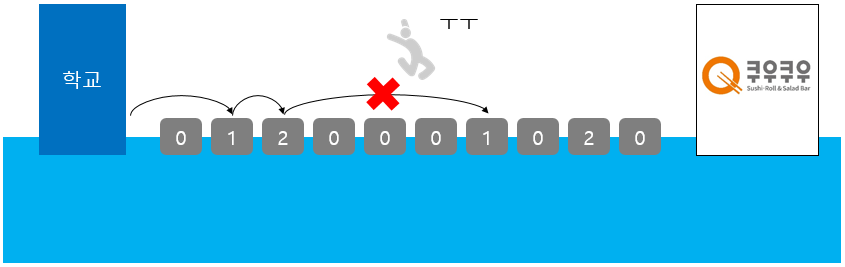

# 1주차 문제4 - 징검다리 건너기

|구분|값|
|---|---|
|난이도|3|
|점수|3|
|출처|https://programmers.co.kr/learn/courses/30/lessons/64062|

## 문제 설명
디닷컴의 `동아리 회원들`이 `김진호 회장님`과 함께 종강 총회을 가는 중에 징검다리가 있는 개울을 만나서 건너편으로 건너려고 합니다. `김진호 회장님`은 `동아리 회원들`이 무사히 징검다리를 건널 수 있도록 다음과 같이 규칙을 만들었습니다.

- 징검다리는 일렬로 놓여 있고 각 징검다리의 디딤돌에는 모두 숫자가 적혀 있으며 디딤돌의 숫자는 한 번 밟을 때마다 1씩 줄어듭니다.
- 디딤돌의 숫자가 0이 되면 더 이상 밟을 수 없으며 이때는 그 다음 디딤돌로 한번에 여러 칸을 건너 뛸 수 있습니다.
- 단, 다음으로 밟을 수 있는 디딤돌이 여러 개인 경우 무조건 가장 가까운 디딤돌로만 건너뛸 수 있습니다.

`동아리 회원들`은 개울의 왼쪽에 있으며, 개울의 오른쪽 건너편에 도착해야 징검다리를 건넌 것으로 인정합니다.
`동아리 회원들`은 한 번에 한 명씩 징검다리를 건너야 하며, 한 회원이 징검다리를 모두 건넌 후에 그 다음 친구가 건너기 시작합니다.

디딤돌의 갯수 `n`, 한 번에 건너뛸 수 있는 디딤돌의 최대 칸 수 `k`, 각 디딤돌에 적힌 숫자들의 배열 `stones`가 주어질 때, 최대 몇 명까지 징검다리를 건너 종강 총회에 갈 수 있는지 출력하는 프로그램을 만들어주세요.

## 제한 사항
- 디닷컴은 매우 흥한 동아리이기 때문에 **회원수가 무제한**입니다.
- 1 ≤ n ≤ 200,000
- 1 ≤ k ≤ n
- 1 ≤ stones의 각 원소 ≤ 2억

## 입력
첫째 줄에 n과 k가 주어집니다.

둘째 줄에 stones 배열이 0번부터 `n-1`번까지 차례로 주어집니다.

## 출력
첫째 줄에 징검다리를 건너 종강 총회에 도착한 회원의 수를 출력합니다.

## 예시
### 예시1
**입력**

```
10 3
2 4 5 3 2 1 4 2 5 1
```

**출력**
```
3
```

**설명**

첫 번째 회원은 다음과 같이 징검다리를 건널 수 있습니다.


첫 번째 회원이 징검다리를 건넌 후 디딤돌에 적힌 숫자는 아래 그림과 같습니다.<br>
두 번째 회원도 아래 그림과 같이 징검다리를 건널 수 있습니다.



두 번째 회원이 징검다리를 건넌 후 디딤돌에 적힌 숫자는 아래 그림과 같습니다.<br>
세 번째 회원도 아래 그림과 같이 징검다리를 건널 수 있습니다.



세 번째 회원이 징검다리를 건넌 후 디딤돌에 적힌 숫자는 아래 그림과 같습니다.<br>
네 번째 회원이 징검다리를 건너려면, 2번째 디딤돌에서 6번째 디딤돌로 네 칸을 건너뛰어야 합니다. 하지만 k = 3 이므로 건너뛸 수 없습니다.



따라서 3명의 회원이 징검다리를 건너 종강총회에 갈 수 있습니다.
