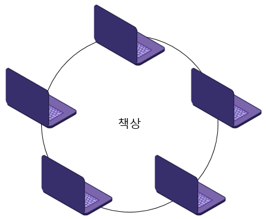

# 1주차 문제5 - 도둑질

|구분|값|
|---|---|
|난이도|4|
|점수|4|
|출처|https://programmers.co.kr/learn/courses/30/lessons/42897|

## 문제 설명
도둑이 디닷컴 동아리방을 털 계획을 하고 있습니다. 디닷컴 동아리 방에는 큰 원형 책상이 놓여있고, 책상에 노트북들이 아래 그림과 같이 동그랗게 배치되어 있습니다.



노트북들은 인접한 노트북들과 방범장치가 연결되어 있습니다. 따라서 인접한 두 노트북을 건드리면 경보가 울립니다.

도둑은 이 방범장치를 피해 최대한 중고 판매 가격이 비싼 노트북들을 훔치려고 합니다. 도둑은 컴퓨터 전문가이기 때문에 노트북을 보면 바로 중고 판매 가격을 알 수 있습니다.

책상 위 노트북의 갯수 `n`, 각 노트북들의 중고 판매 가격이 담긴 배열 `money`가 주어질 때, 도둑이 훔칠 수 있는 노트북들의 중고 판매 가격의 최댓값을 구하는 프로그램을 만들어주세요.

## 제한 사항
- 3 ≤ n ≤ 1,000,000
- 0 ≤ money ≤ 1,000

## 입력
첫째 줄에 n이 주어집니다.

둘째 줄에 money 배열이 0번부터 `n-1`번까지 차례로 주어집니다.

## 출력
첫째 줄에 도둑이 훔칠 수 있는 노트북들의 중고 판매 가격의 최댓값을 출력합니다.

## 예시
### 예시1
**입력**

```
4
1 2 3 1
```

**출력**
```
4
```

**설명**


