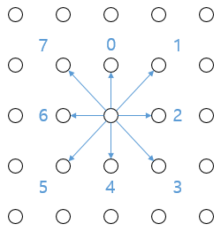
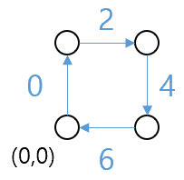
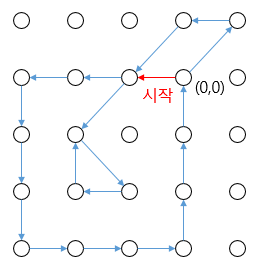

# 2주차 문제5 - 방의 개수

|구분|값|
|---|---|
|난이도|4|
|점수|4|
|출처|https://programmers.co.kr/learn/courses/30/lessons/49190|

## 문제 설명
원점(0,0)에서 시작해서 주어진 방향으로 이동하며 선을 긋습니다. 방향은 아래 그림과 같이 윗 방향을 0으로 하며, 시계 방향으로 45도씩 숫자가 1이 증가합니다.



ex) 1일때는 `오른쪽 위`로 이동

그림을 그릴 때, **사방이 막히면 방 하나**로 셉니다. 예를 들어, 주어진 방향이 0, 2, 4, 6이라고 하면 아래와 같은 정사각형의 방이 만들어집니다.



이와 같은 방법으로 삼각형, 평행사변형 등 여러 모양의 방이 만들어질 수 있습니다.

이동하는 방향의 갯수 n, 이동하는 방향이 담긴 배열 arrows가 주어질 때, 방의 갯수를 출력하는 프로그램을 만들어주세요.

## 제한 사항
- 1 ≤ n ≤ 100,000
- 0 ≤ arrows의 원소 ≤ 7
- 방은 다른 방으로 둘러 싸여질 수 있고, 이 경우 각각을 셉니다.
- 한 방이 여러번 그려질 수 있고, 이 경우 하나만 셉니다.

## 입력
첫째 줄에 n이 주어집니다.

둘째 줄에 arrows의 각 원소가 하나씩 주어집니다.

## 출력
첫째 줄에 방의 갯수를 출력합니다.

## 예시
### 예시1
**입력**
```
19
6 6 6 4 4 4 2 2 2 0 0 0 1 6 5 5 3 6 0
```

**출력**
```
3
```

**설명**



- 삼각형(1) + 사각형(1) + 평행사변형(1) = 3
