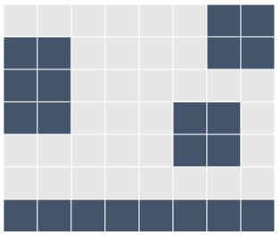
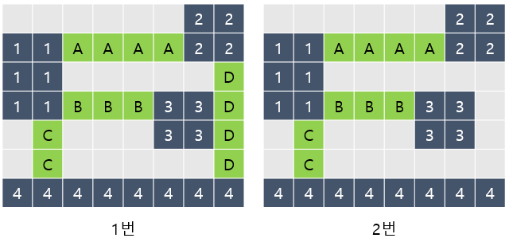
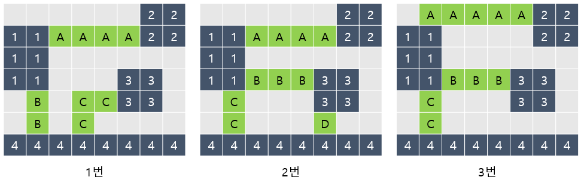
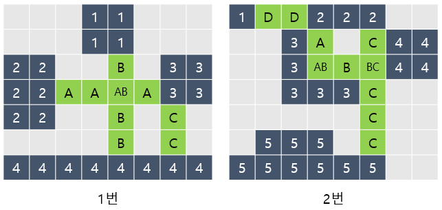

# 3주차 문제4 - 다리 만들기

|구분|값|
|---|---|
|난이도|3|
|점수|3|
|출처|https://www.acmicpc.net/problem/17472|

## 문제 설명
프로그래머 `황지원`은 경희대학교로부터 `경희대학교 가상캠퍼스` 구축을 의뢰받았습니다. 모든 건물의 렌더링을 마치고 이제 각 건물들을 연결할 차례입니다.

`경희대학교 가상캠퍼스`는 `N`x`M` 크기의 지도 안에 놓여 있고, 격자의 각 칸은 건물이거나 땅입니다. 아래 그림은 4개의 건물로 이루어진 가상캠퍼스입니다. 색칠되어 있는 칸은 건물입니다.



다리는 땅에만 건설할 수 있고, 다리의 길이는 다리가 격자에서 차지하는 칸의 수입니다. 다리를 연결해서 모든 건물을 연결하려고 합니다. 건물A에서 다리를 통해 건물B로 갈 수 있을 때, 건물A와 건물B가 연결되어있다고 합니다. 다리의 양 끝은 건물과 인접한 땅 위에 있어야 하고, 다리의 방향이 중간에 바뀌면 안 됩니다. 또한, 다리의 길이는 2 이상이어야 합니다.

다리의 방향이 중간에 바뀌면 안 되기 때문에, 다리의 방향은 가로 또는 세로가 될 수밖에 없습니다. 방향이 가로인 다리는 다리의 양 끝이 가로 방향으로 건물과 인접해야 하고, 방향이 세로인 다리는 다리의 양 끝이 세로인 방향으로 건물과 인접해야 합니다.

건물A와 건물B를 연결하는 다리가 중간에 건물C와 인접한 땅을 지나가는 경우에 건물C는 A, B와 연결되어있는 것이 아닙니다.

아래 그림은 건물을 모두 연결하는 올바른 2가지 방법이고, 다리는 초록색으로 색칠되어 있습니다. 건물은 정수, 다리는 알파벳 대문자로 구분합니다.


1. (길이 : 13) D는 2와 4를 연결하는 다리이고, 3과는 연결되어 있지 않습니다.
2. (길이 : 9) 최소

다음은 올바르지 않은 3가지 방법입니다.


1. C의 방향이 중간에 바뀌었습니다.
2. D의 길이가 1입니다.
3. 가로 다리인 A가 1과 가로로 연결되어 있지 않습니다.

다리가 교차하는 경우가 있을 수도 있습니다. 교차하는 다리의 길이를 계산할 때는 각 칸이 각 다리의 길이에 모두 포함되어야 합니다. 아래는 다리가 교차하는 경우와 기타 다른 경우에 대한 2가지 예시입니다.


1. A:4, B:4, C:2 이므로 총 길이는 `4+4+2=10`
2. A:2, B:3, C:5, D:2 이므로 총 길이는 `2+3+5+2=12`

`황지원`은 오브젝트의 수를 줄이기 위해 가능한 적은 수의 다리로 모든 건물을 연결하려고 합니다.

`경희대학교 가상캠퍼스`의 크기 `N`x`M`과 각 건물들의 위치 정보가 주어졌을 때, 모든 건물들을 연결하는 다리 길이의 최솟값을 구하는 프로그램을 만들어주세요.

## 제한 사항
- 1 ≤ N, M ≤ 10
- 3 ≤ N * M ≤ 100
- 2 ≤ 건물의 개수 ≤ 6

## 입력
첫째 줄에 N과 M이 주어집니다.

둘째 줄부터 지도 정보가 주어집니다. 0은 땅을, 인접한 1들의 모임은 건물을 의미합니다.

## 출력
첫째 줄에 모든 건물을 연결하는 다리 길이의 최솟값을 출력합니다. 모든 건물을 연결하는 것이 불가능하다면 -1을 출력합니다.

## 예시
### 예시1
**입력**

```
7 8
0 0 0 0 0 0 1 1
1 1 0 0 0 0 1 1
1 1 0 0 0 0 0 0
1 1 0 0 0 1 1 0
0 0 0 0 0 1 1 0
0 0 0 0 0 0 0 0
1 1 1 1 1 1 1 1
```

**출력**
```
9
```

**설명**

문제의 예시와 같습니다.


### 예시2
**입력**

```
7 8
0 0 0 1 1 0 0 0
0 0 0 1 1 0 0 0
1 1 0 0 0 0 1 1
1 1 0 0 0 0 1 1
1 1 0 0 0 0 0 0
0 0 0 0 0 0 0 0
1 1 1 1 1 1 1 1
```

**출력**
```
10
```

**설명**

문제의 예시와 같습니다.


### 예시3
**입력**

```
7 8
1 0 0 1 1 1 0 0
0 0 1 0 0 0 1 1
0 0 1 0 0 0 1 1
0 0 1 1 1 0 0 0
0 0 0 0 0 0 0 0
0 1 1 1 0 0 0 0
1 1 1 1 1 1 0 0
```

**출력**
```
9
```

**설명**

문제의 예시와 같습니다.


### 예시4
**입력**

```
7 7
1 1 1 0 1 1 1
1 1 1 0 1 1 1
1 1 1 0 1 1 1
0 0 0 0 0 0 0
1 1 1 0 1 1 1
1 1 1 0 1 1 1
1 1 1 0 1 1 1
```

**출력**
```
-1
```

**설명**

모든 건물을 길이가 2 이상인 다리로 연결할 수 없습니다.
