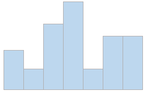
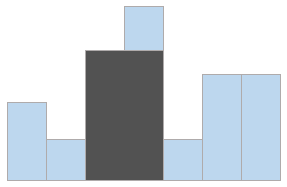

# 3주차 문제5 - 히스토그램

|구분|값|
|---|---|
|난이도|4|
|점수|4|
|출처|https://www.acmicpc.net/problem/1725|

## 문제 설명
히스토그램은 아래와 같은 막대그래프를 말합니다.



각 칸의 간격은 일정하고, 높이는 어떤 정수로 주어집니다. 위 그림의 경우 높이가 각각 2 1 4 5 1 3 3 입니다.

이러한 히스토그램의 내부에 가장 넓이가 큰 직사각형을 그리려고 합니다. 아래 그림의 색칠된 부분이 그 예입니다. 이 직사각형의 밑변은 항상 히스토그램의 아랫변에 평행하게 그려져야 합니다.



히스토그램의 가로 칸 수 `n`과 히스토그램의 각 높이 `heights`이 주어질 때, 히스토그램 내의 가장 큰 직사각형의 넓이를 구하는 프로그램을 만들어주세요.

## 제한 사항
- 1 ≤ n ≤ 100,000
- 0 ≤ heights의 각 원소 ≤ 10억
- 0 ≤ 가장 큰 직사각형의 넓이 (출력 값) < 20억

## 입력
첫째 줄에 N이 주어집니다.

둘째 줄에 heights가 순서대로 주어집니다.

## 출력
첫째 줄에 가장 큰 직사각형의 넓이를 출력합니다.

## 예시
### 예시1
**입력**

```
7
2 1 4 5 1 3 3
```

**출력**
```
8
```

**설명**

문제의 예시와 같습니다.


### 예시2
**입력**

```
5
1 1 1 1 1
```

**출력**
```
5
```

**설명**

높이가 1, 길이가 5인 직사각형이 최대입니다.


### 예시3
**입력**

```
5
1 2 3 4 5
```

**출력**
```
9
```

**설명**

높이가 3, 길이가 3인 직사각형이 최대입니다.
