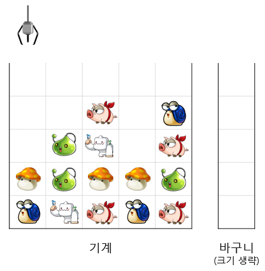
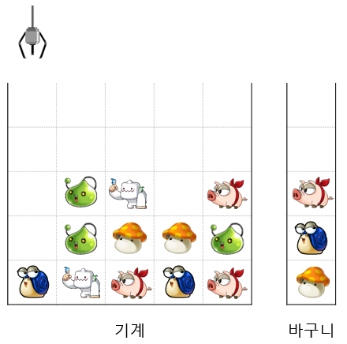
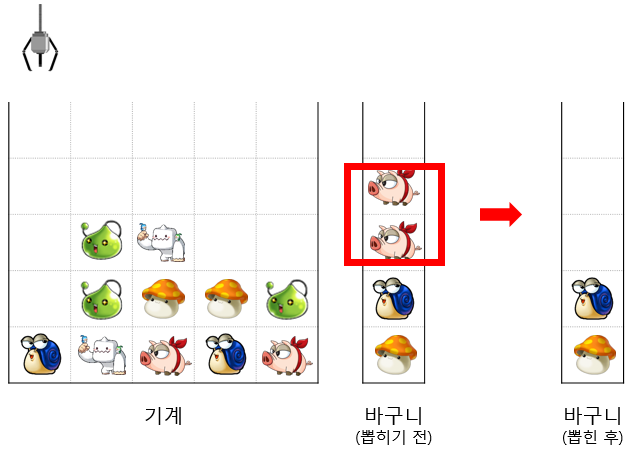
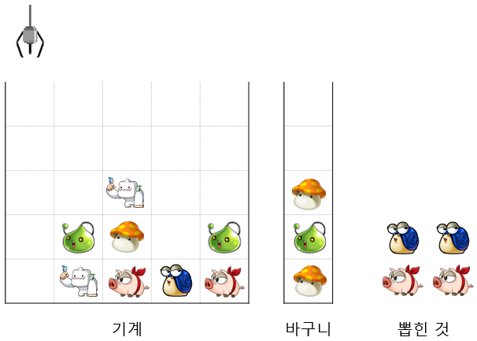

# 4주차 문제1 - 인형뽑기

|구분|값|
|---|---|
|난이도|1|
|점수|1|
|출처|https://programmers.co.kr/learn/courses/30/lessons/64061|

## 문제 설명
인형뽑기의 장인 `손지언`은 특별한 규칙이 있는 인형뽑기 기계를 발견하여 오랜만에 자신의 실력을 뽐내보려고 합니다. 이 인형뽑기 기계의 규칙은 다음과 같습니다.

1. 인형뽑기 기계는 크기가 `n`인 정사각 격자 형태의 기계와, 모든 인형을 담을 수 있는 크기의 바구니로 구성되어있습니다.
2. 인형은 아래에서부터 차곡차곡 쌓여 있습니다.
3. 사용자는 각 칸에 있는 인형 중 가장 위에 있는 인형을 집어 올려 바구니에 넣을 수 있습니다.
4. 바구니에 같은 모양의 인형이 연속해서 쌓이게 되면 그 즉시 인형이 뽑혀 사용자에게 주어집니다.

가령 아래와 같이 크기가 5인 인형뽑기 기계가 주어졌다고 합시다. (바구니는 모든 인형을 담을 수 있는 크기여야 하지만 그림상 생략되었습니다.)



이 인형뽑기 기계에서 `1번`, `5번`, `3번` 위치에서 순서대로 인형을 집어 올리면 다음과 같은 상태가 됩니다.



이 상태에서 `5번` 위치에서 추가로 인형을 집어 올리면 리본돼지 인형이 2개가 연속해서 쌓이게 되어 리본돼지 인형이 즉시 뽑힙니다.



인형 뽑기 기계의 크기 `n`, 기계의 각 격자 위치마다 놓인 인형 `board`, 기계를 움직인 횟수 `k`, 어떤 위치로 움직였는지를 담은 배열 `moves`가 주어질 때, 손지언이 뽑은 인형의 갯수를 구하는 프로그램을 만들어주세요.

## 제한 사항
- 5 ≤ n ≤ 30
- 1 ≤ k ≤ 100
- 0 ≤ board의 각 요소 ≤ 100
- 1 ≤ moves의 각 요소 ≤ n
- board의 각 요소는 인형을 정수 형태로 구분하며, 같은 숫자는 같은 인형을 나타냅니다.
- 손지언은 인형 뽑기의 장인이기 때문에 인형을 중간에 떨어뜨리지 않습니다.
- 하지만 가끔 실수를 할 때가 있기 때문에 인형이 없는 위치로 기계를 움직일 때도 있습니다.

## 입력
첫째 줄에 n과 k가 주어집니다.

둘째 줄에 moves가 공백을 구분으로 하나씩 주어집니다.

셋째 줄부터 board가 각 줄마다 주어집니다.

## 출력
첫째 줄에 뽑은 인형의 갯수를 출력합니다.

## 예시
### 예시1
**입력**
```
5 4
1 5 3 5
0 0 0 0 0
0 0 1 0 3
0 2 5 0 1
4 2 4 4 2
3 5 1 3 1
```

**출력**
```
2
```

**설명**

문제의 예시와 같습니다.


### 예시2
**입력**
```
5 8
1 5 3 5 1 2 1 4
0 0 0 0 0
0 0 1 0 3
0 2 5 0 1
4 2 4 4 2
3 5 1 3 1
```

**출력**
```
4
```

**설명**

아래 그림과 같이 리본돼지, 파란달팽이 인형을 각 2개씩 뽑을 수 있습니다.

> (hint) 7번째 기계 조작에서 실수로 인형이 없는 위치로 조작했기 때문에 7번째 기계 조작에서는 아무 일도 일어나지 않았습니다.



