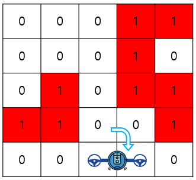

# 4주차 문제3 - 로봇

|구분|값|
|---|---|
|난이도|3|
|점수|3|
|출처|https://programmers.co.kr/learn/courses/30/lessons/60063|

## 문제 설명
로봇개발자 `윤창목`은 한 달 앞으로 다가온 `디닷컴배 로봇 경진대회`에 출품할 로봇을 준비중입니다. 준비중인 로봇은 `2 x 1` 크기의 로봇으로, 크기가 `n`인 정사각형의 맵에서 `(1, 1)` 위치에서 시작하여 `(n, n)` 위치까지 이동할 수 있도록 프로그래밍을 하려고 합니다.

맵의 0은 빈칸, 1은 벽을 의미하며, 맵의 좌표는 최상단 최좌측을 `(1, 1)`으로 나타내고, 로봇은 처음에 아래 그림과 같이 `(1, 1)`, `(1, 2)` 위치에 가로로 놓여져 있습니다.


로봇은 현재 놓여진 상태를 유지하면서 빈칸으로 상하좌우로 한칸씩 이동할 수 있고, 벽이나 맵 밖으로는 이동할 수 없습니다.

또한 로봇은 아래 그림과 같이 90도씩 회전도 가능합니다. 로봇이 차지하는 두 칸 중 어느 칸이든 축이 될 수 있지만, 회전하는 방향에는 벽이 없어야 합니다.


로봇이 회전하거나 이동하는 것은 모두 1초가 걸린다고 할 때, 목표 위치인 `(n, n)`까지 이동하는 최소 시간을 구하려고 합니다.

맵의 크기 `n`, 맵의 각 요소가 담긴 배열 `board`이 주어졌을 때, `(n, n)`까지 이동하는데 걸리는 최소 시간을 구하는 프로그램을 만들어주세요.


## 제한 사항
- 5 ≤ n ≤ 100
- board의 각 요소는 0(빈칸) 또는 1(벽)
- 로봇이 처음 놓여있는 칸 `(1, 1)`과 `(1, 2)`는 항상 0으로 주어집니다.
- 로봇은 항상 목적지에 도착할 수 있습니다.

## 입력
첫째 줄에 n이 주어집니다.

둘째 줄부터 board이 주어집니다.

## 출력
첫째 줄에 `(n, n)`까지 이동하는데 걸리는 최소 시간을 출력합니다.

## 예시
### 예시1
**입력**
```
5
0 0 0 1 1
0 0 0 1 0
0 1 0 1 1
1 1 0 0 1
0 0 0 0 0
```

**출력**
```
7
```

**설명**

1. 오른쪽으로 이동

  

2. `(1, 3)`을 축으로 반시계 방향으로 90도 회전

  

3. 아래로 이동

  

4. 아래로 이동

  

5. 아래로 이동

  

6. `(5, 3)`을 축으로 시계 방향으로 90도 회전

  

7. 오른쪽으로 이동 (도착)

  
