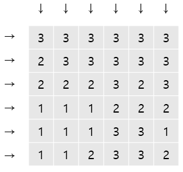
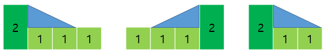
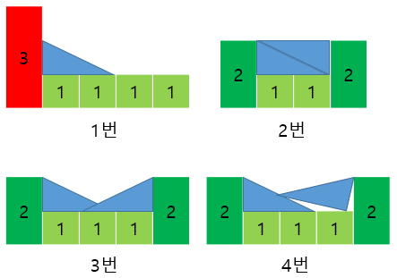
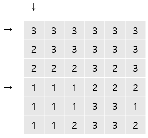
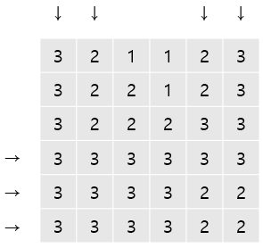
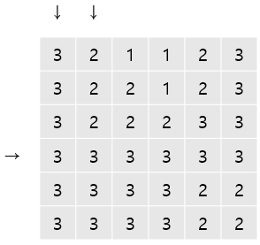
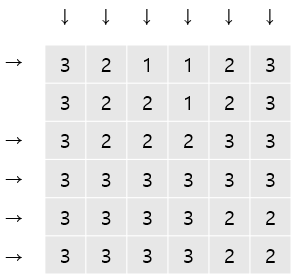

# 4주차 문제4 - 경사로

|구분|값|
|---|---|
|난이도|3|
|점수|3|
|출처|https://www.acmicpc.net/problem/14890|

## 문제 설명
크기가 `N`인 정사각형의 지도가 있습니다. 지도의 각 칸에는 그 곳의 높이가 적혀져 있습니다.

오늘은 이 지도에서 지나갈 수 있는 길이 몇 개 있는지 알아보려고 합니다. 길이란 한 행 또는 한 열 전부를 나타내며, 한쪽 끝에서 다른쪽 끝까지 지나가는 것입니다. 즉, 경로가 같고 방향만 다른 경우는 하나로 취급합니다.

다음과 같은 N = 6인 경우 다음과 같이 길이 총 `2N`개가 있습니다.



길을 지나갈 수 있으려면 길에 속한 모든 칸의 높이가 모두 같아야 합니다. 또는, 경사로를 놓아서 지나갈 수 있는 길을 만들 수 있습니다. 경사로는 높이가 항상 1이며, 길이는 `L`입니다. 경사로의 개수는 매우 많아 부족할 일이 없습니다. 경사로는 낮은 칸과 높은 칸을 연결하며, 아래와 같은 조건을 만족해야합니다.
- 경사로는 낮은 칸에 놓으며, L개의 연속된 칸에 경사로의 바닥이 모두 접해야 합니다.
- 낮은 칸과 높은 칸의 높이 차이는 1이어야 합니다.
- 경사로를 놓을 낮은 칸의 높이는 모두 같아야 하고, L개의 칸이 연속되어 있어야 합니다.

아래와 같은 경우에는 경사로를 놓을 수 없습니다.
- 경사로를 놓은 곳에 또 경사로를 놓는 경우
- 낮은 칸과 높은 칸의 높이 차이가 1이 아닌 경우
- 낮은 지점의 칸의 높이가 모두 같지 않거나, L개가 연속되지 않은 경우
- 경사로를 놓다가 범위를 벗어나는 경우

L = 2인 경우에 경사로를 놓을 수 있는 경우를 그림으로 나타내면 아래와 같습니다.



놓을 수 없는 경우는 아래와 같습니다.



각각의 이유는 아래와 같습니다.
1. 높이 차이가 1이 아닙니다.
2. 경사로를 바닥에 접하게 놓지 않았습니다.
3. 겹쳐서 놓았습니다.
4. 기울이게 놓았습니다.

이와 같은 방법으로 L = 2인 경우에 지나갈 수 있는 길만 표시하면 아래와 같습니다.



## 제한 사항
- 2 ≤ N ≤ 100
- 1 ≤ L ≤ N
- 1 ≤ 각 칸의 높이 ≤ 10

## 입력
첫째 줄에 N과 L이 주어집니다.

둘째 줄부터 N개의 줄에 지도가 주어집니다.

## 출력
첫째 줄에 지나갈 수 있는 길의 개수를 출력합니다.

## 예시
### 예시1
**입력**
```
6 2
3 3 3 3 3 3
2 3 3 3 3 3
2 2 2 3 2 3
1 1 1 2 2 2
1 1 1 3 3 1
1 1 2 3 3 2
```

**출력**
```
3
```

**설명**

문제의 예시와 같습니다.


### 예시2
**입력**
```
6 2
3 2 1 1 2 3
3 2 2 1 2 3
3 2 2 2 3 3
3 3 3 3 3 3
3 3 3 3 2 2
3 3 3 3 2 2
```

**출력**
```
7
```

**설명**




### 예시3
**입력**
```
6 3
3 2 1 1 2 3
3 2 2 1 2 3
3 2 2 2 3 3
3 3 3 3 3 3
3 3 3 3 2 2
3 3 3 3 2 2
```

**출력**
```
3
```

**설명**




### 예시4
**입력**
```
6 1
3 2 1 1 2 3
3 2 2 1 2 3
3 2 2 2 3 3
3 3 3 3 3 3
3 3 3 3 2 2
3 3 3 3 2 2
```

**출력**
```
11
```

**설명**



