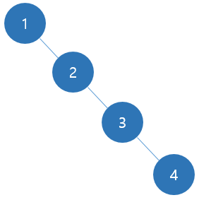
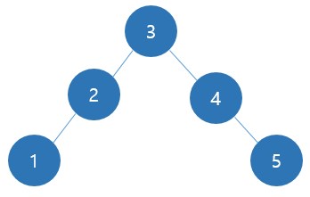
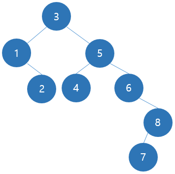

# 4주차 문제5 - 이진 탐색 트리

|구분|값|
|---|---|
|난이도|4|
|점수|4|
|출처|https://www.acmicpc.net/problem/2957|

## 문제 설명
알고리즘을 사랑하는 ~~변태~~ 프로그래머 `손현수`는 자신이 만든 `이진 탐색 트리`의 효율을 측정해보려고 합니다.

이진 탐색 트리란 모든 노드가 많아야 2개의 자식 노드를 가지고 있는 트리이고, 각 노드에는 수가 하나씩 쓰여있으며, 만약 어떤 노드에 쓰여져 있는 수가 `x`라면 그 왼쪽 서브트리에는 `x`보다 작은 수, 오른쪽 서브트리에는 `x`보다 큰 수만 저장되어 있는 자료구조를 말합니다.

손현수는 이진 탐색 트리에 값을 삽입하는 함수 `insert`를 아래와 같은 수도 코드로 구현하였습니다.

```
insert(number x, node n)
  if x < n.value
    if n.left = null
      child := new node
      child.value := x
      n.left := child
    else
      insert(x, n.left)
  else
    if n.right = null
      child := new node
      child.value := x
      n.right := child
    else
      insert(x, n.right)
```

이 insert 함수의 효율을 측정하기 위해, insert 함수가 한 번 호출될 때마다 누적 카운트 `c`를 하나씩 증가시켜 이 값을 확인해보려고 합니다. 단, 루트 노드에 들어가는 경우는 insert 함수가 실행되지 않고, 따라서 `c`값 역시 변하지 않습니다.

이진 트리에 넣을 값들의 갯수 `n`, 각 값들 `values`가 주어질 때, 각 값들이 이진 트리에 삽입된 후의 `c`값을 출력하는 프로그램을 만들어주세요.

## 제한 사항
- 1 ≤ n ≤ 100,000
- 1 ≤ values의 각 요소 ≤ n
- 각 값들은 중복되지 않는 정수

## 입력
첫째 줄에 n이 주어집니다.

둘째 줄에 values의 각 요소가 하나씩 주어집니다.

## 출력
첫째 줄부터 values의 각 요소가 삽입된 후의 c값을 한 줄에 하나씩 출력합니다.

## 예시
### 예시1
**입력**
```
4
1 2 3 4
```

**출력**
```
0
1
3
6
```

**설명**



- 1 : root에 들어가기 때문에 0
- 2 : insert 함수가 1번 호출되므로 1 + 누적 값 0 = 1
- 3 : insert 함수가 2번 호출되므로 2 + 누적 값 1 = 3
- 4 : insert 함수가 3번 호출되므로 3 + 누적 값 3 = 6

### 예시2
**입력**
```
5
3 2 4 1 5
```

**출력**
```
0
1
2
4
6
```

**설명**



- 3 : root에 들어가기 때문에 0
- 2 : insert 함수가 1번 호출되므로 1 + 누적 값 0 = 1
- 4 : insert 함수가 1번 호출되므로 1 + 누적 값 1 = 2
- 1 : insert 함수가 2번 호출되므로 2 + 누적 값 2 = 4
- 5 : insert 함수가 2번 호출되므로 2 + 누적 값 4 = 6


### 예시3
**입력**
```
8
3 5 1 6 8 7 2 4
```

**출력**
```
0
1
2
4
7
11
13
15
```

**설명**



- 3 : root에 들어가기 때문에 0
- 5 : insert 함수가 1번 호출되므로 1 + 누적 값 0 = 1
- 1 : insert 함수가 1번 호출되므로 1 + 누적 값 1 = 2
- 6 : insert 함수가 2번 호출되므로 2 + 누적 값 2 = 4
- 8 : insert 함수가 3번 호출되므로 3 + 누적 값 4 = 7
- 7 : insert 함수가 4번 호출되므로 4 + 누적 값 7 = 11
- 2 : insert 함수가 2번 호출되므로 2 + 누적 값 11 = 13
- 4 : insert 함수가 2번 호출되므로 2 + 누적 값 13 = 15
