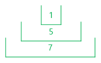
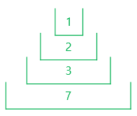

# 5주차 문제2 - 상자 쌓기

|구분|값|
|---|---|
|난이도|2|
|점수|2|
|출처|https://www.acmicpc.net/problem/1965|

## 문제 설명
오늘은 분리수거 하는 날, 디닷컴 청소부장 `오세헌`은 동아리방에 쌓여 있는 상자들을 정리하려고 합니다. 상자마다 크기가 정해져 있고, 앞에 있는 상자 크기가 뒤에 있는 상자 크기보다 작으면 앞에 있는 상자를 뒤에 있는 상자 안에 넣을 수 있습니다.

예를 들어, 앞에서부터 순서대로 크기가 1, 5, 2, 3, 7인 상자가 있다고 해봅시다.


크기가 1인 상자를 크기가 5인 상자 안에 넣고, 다시 이 상자를 크기가 7인 상자 안에 넣을 수 있습니다.



반면에 크기가 1, 2, 3, 7인 상자를 차례로 넣으면 아래 그림과 같이 총 4개의 상자가 한 개의 상자에 들어가게 됩니다.



`오세헌`은 최대한 많은 상자를 한 번에 쌓아서 정리하려고 합니다.

상자의 갯수 `n`, 각 상자의 크기들 `boxes`가 주어질 때, 한 번에 쌓을 수 있는 최대의 상자 갯수를 구하는 프로그램을 만들어주세요.

## 제한 사항
- 1 ≤ n ≤ 1,000
- 1 ≤ boxes의 각 요소 ≤ 1,000,000
- 상자는 앞에서부터 뒤로만 쌓을 수 있습니다.

## 입력
첫째 줄에 n이 주어집니다.

둘째 줄에 boxes가 하나씩 주어집니다.

## 출력
첫째 줄에 쌓을 수 있는 최대의 상자 갯수를 출력합니다.

## 예시
### 예시1
**입력**
```
5
1 5 2 3 7
```

**출력**
```
4
```

**설명**

문제의 예시와 같습니다.


### 예시2
**입력**
```
8
1 6 2 5 7 3 5 6
```

**출력**
```
5
```

**설명**

1, 2, 3, 5, 6 크기의 상자를 순서대로 쌓습니다.
