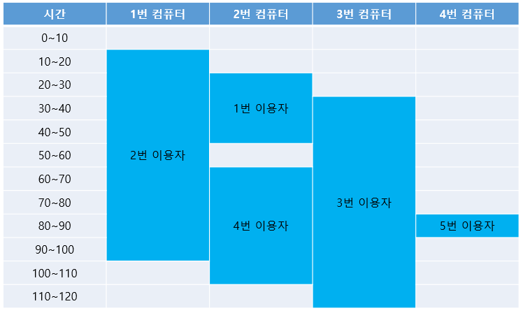
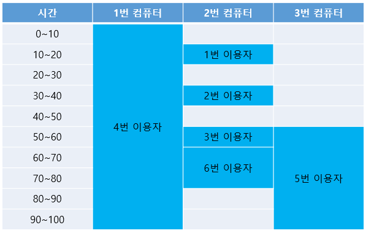

# 5주차 문제3 - 싸지방

|구분|값|
|---|---|
|난이도|3|
|점수|3|
|출처|https://www.acmicpc.net/problem/12764|

## 문제 설명
강한친구 대한육군 `송용우`는 프로그래밍 공부를 위해 매일같이 사이버 지식 정보방(통칭 싸지방)에 다닙니다. 하지만 최근 싸지방에 사람이 몰려 컴퓨터 수가 부족해졌습니다. 매일매일 프로그래밍 공부를 하고 싶었던 송용우는 행정보급관님을 설득해 컴퓨터를 증설할 수 있도록 허락을 받았습니다.

다만 예산이 한정되어있기 때문에 정확한 수요를 파악해 정확히 필요한 양 만큼만 컴퓨터를 설치할 수 있다고 합니다. 그래서 송용우는 싸지방을 이용하는 모든 부대원들의 사용 패턴을 분석했고, 모두가 항상 정해진 시간에 싸지방을 이용한다는 것을 알게 되었습니다.

송용우가 분석한 싸지방 사용 패턴 정보를 바탕으로 예상 컴퓨터 이용량을 구하려고 합니다.

각 컴퓨터가 있는 자리에는 1번부터 차례로 번호가 매겨져 있고, 모든 부대원들은 싸지방에 들어왔을 때 비어있는 자리 중 번호가 가장 작은 자리에 앉습니다.

싸지방을 이용하는  수 `n`, 각 이용자의 이용 시간 `timetable`이 주어질 때, 싸지방을 모두가 이용할 수 있는 최소 컴퓨터 대수와 각 자리별 이용자 수를 구하는 프로그램을 만들어주세요.

## 제한 사항
- 1 ≤ n ≤ 100,000
- timetable은 이용 시작 시각 `start`, 이용 종료 시각 `end`로 구성되어 있습니다.
- 0 ≤ start < end ≤ 1,000,000
- 한 부대원의 종료 시각과 다른 부대원의 시작 시각이 겹치는 경우 둘 다 같은 컴퓨터를 이용할 수 있습니다.
- 시작 시각이 동일한 부대원이 여러 명 있는 경우 종료 시각이 더 빠른 부대원부터 번호가 작은 자리에 앉습니다.

## 입력
첫째 줄에 n이 주어집니다.

둘째 줄부터 timetable의 start와 end가 각각 주어집니다.

## 출력
첫째 줄에 싸지방을 모두가 이용할 수 있는 최소 컴퓨터 대수를 출력합니다.

둘째 줄에 각 자리별 이용자 수를 공백을 기준으로 나누어 하나씩 출력합니다.

## 예시
### 예시1
**입력**
```
5
20 50
10 100
30 120
60 110
80 90
```

**출력**
```
4
1 2 1 1
```

**설명**




### 예시2
**입력**
```
6
10 20
30 40
50 60
0 100
50 100
60 80
```

**출력**
```
3
1 4 1
```

**설명**


