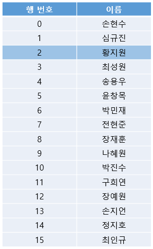
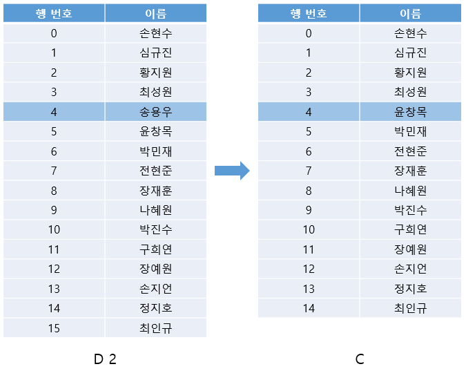
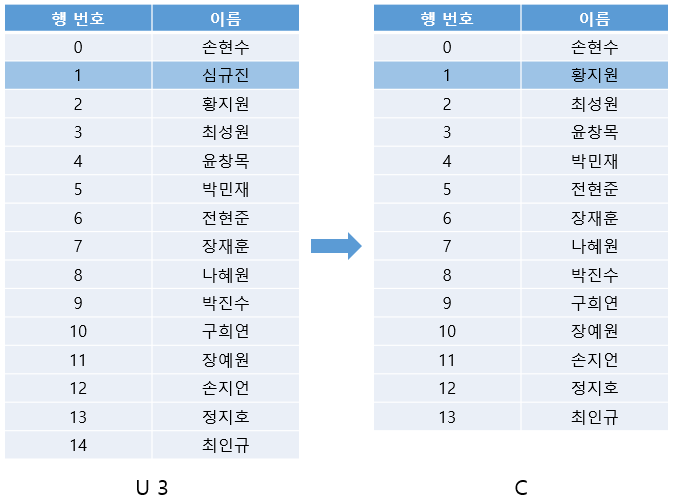
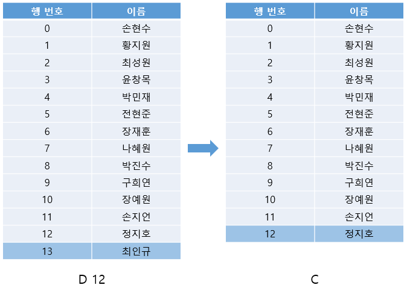
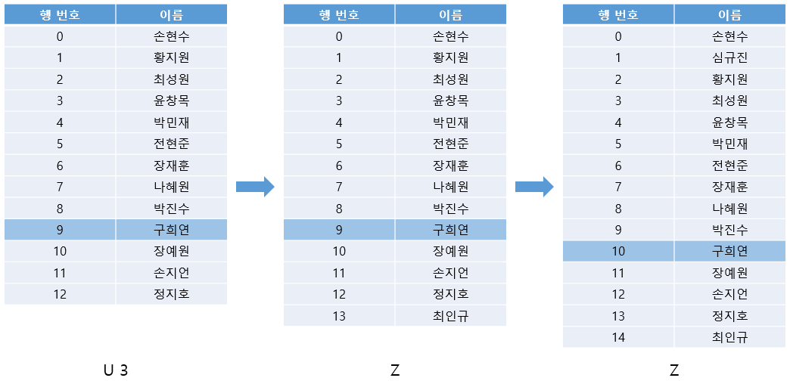
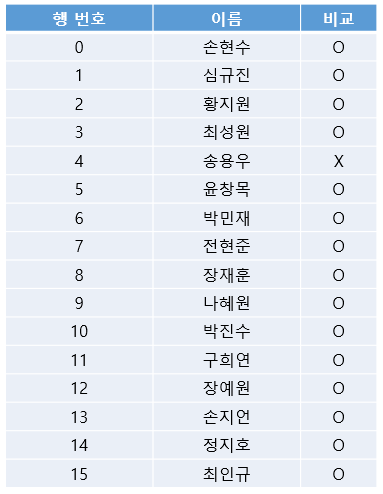
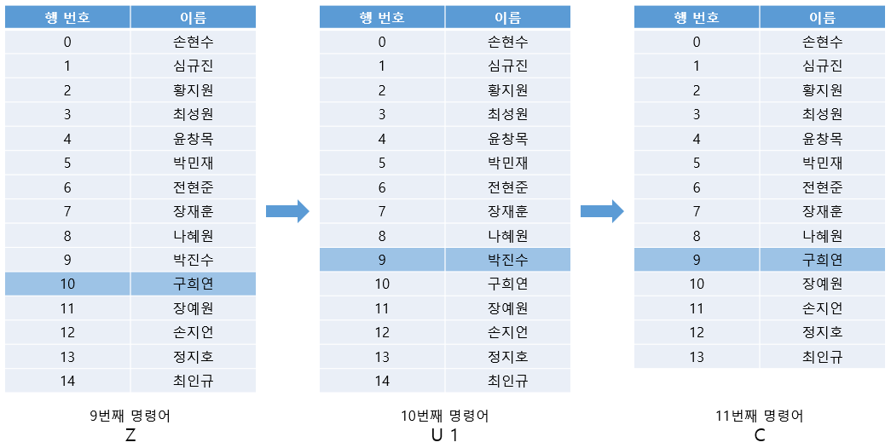

# 5주차 문제4 - 명단 관리

|구분|값|
|---|---|
|난이도|3|
|점수|3|
|출처|https://programmers.co.kr/learn/courses/30/lessons/81303|

## 문제 설명
개발자 `오윤석`은 2021년 여름방학 디닷컴 코딩테스트 스터디를 위해 명단 관리 프로그램을 만들었습니다. 이 프로그램은 명령어로만 동작하는 프로그램이며, 아래 그림과 같이 하나의 표가 화면에 나타납니다.



위 그림에서 색칠된 칸은 선택된 칸을 나타냅니다. 한 번에 한 행만 선택할 수 있으며, 표의 밖을 벗어날 수 없습니다.

이 프로그램을 동작하기 위한 명령어는 아래와 같습니다.

- `U x` : 현재 선택된 행에서 x칸 위에 있는 행을 선택합니다.
- `D x` : 현재 선택된 행에서 x칸 아래에 있는 행을 선택합니다.
- `C` : 현재 선택된 행을 삭제한 후, 바로 아래 행을 선택합니다. (단, 삭제된 행이 가장 마지막 행인 경우 바로 윗 행을 선택합니다.)
- `Z` : 가장 최근에 삭제된 행을 원래대로 복구합니다. **단, 현재 선택된 행은 바뀌지 않습니다.**

예를 들어, 위 표에서 `D 2`를 구행할 경우 아래 그림처럼 4행이 선택되며, `C`를 수행하면 그 행을 삭제하고 바로 아래 행인 `윤창목`이 적힌 행을 선택합니다. (4행이 삭제되며 아래 있던 행들이 하나씩 밀려 올라오고, 수정된 표에서 다시 4행을 선택하는 것과 동일합니다.)



다음으로 `U 3`을 수행한 다음 `C`를 수행한 후의 표 상태는 아래 그림과 같습니다.



다음으로 `D 12`를 수행한 다음 `C`를 수행한 후의 표 상태는 아래 그림과 같습니다. 13행이 표의 마지막 행이므로, 이 경우 바로 윗 행을 선택하는 점을 주의합니다.



다음으로 `U 3`를 수행한 다음 `Z`를 2번 수행한 후의 표 상태는 아래 그림과 같습니다. 각각 `최인규`, `심규진`이 적힌 행이 차례로 복구되지만 현재 선택된 행은 바뀌지 않습니다.



이때, 모든 명령을 수행한 후 최종 표의 상태와 처음 상태를 비교하여 삭제되지 않은 행은 `O`, 삭제된 행은 `X`로 표시하면 아래 그림과 같습니다.



처음 표의 행 갯수 `n`, 처음에 선택된 행의 위치 `f`, 명령어의 갯수 `k`, 각 명령어 `cmd`가 주어질 때, 처음 표에서 삭제된 행번호들을 구하는 프로그램을 만들어주세요.

## 제한 사항
- 5 ≤ n ≤ 1,000,000
- 0 ≤ f < n
- 1 ≤ k ≤ 200,000
- cmd의 각 요소는 주어진 명령어 `U x`, `D x`, `C`, `Z` 중 하나입니다.
- 1 ≤ cmd의 각 x ≤ 300,000
- 1 ≤ cmd의 각 x의 합 ≤ 1,000,000
- 행이 하나도 남지 않는 경우는 주어지지 않습니다.
- 표의 범위를 넘어서는 이동은 주어지지 않습니다.
- 복구할 행이 없을 때 (즉, 삭제된 행이 없을 때) `Z` 명령이 주어지지 않습니다.
- 문제 설명에서는 각 행의 제거와 복구 과정을 자연스럽게 보여주기 위해 `이름` 열을 사용했지만, `이름` 열이 실제 문제를 구현하는 과정에 필요하지 않습니다. 각 `이름` 열에 서로 다른 이름들이 중복 없이 채워져 있다고 가정하고 문제를 풀어주세요.

## 입력
첫째 줄에 n, f, k가 주어집니다.

둘째 줄부터 cmd가 한 줄에 하나씩 주어집니다.

## 출력
첫째 줄부터 삭제된 행번호를 하나씩 출력합니다.

## 예시
### 예시1
**입력**
```
16 2 9
D 2
C
U 3
C
D 12
C
U 3
Z
Z
```

**출력**
```
4
```

**설명**

문제의 예시와 같습니다.


### 예시2
**입력**
```
16 2 11
D 2
C
U 3
C
D 12
C
U 3
Z
Z
U 1
C
```

**출력**
```
4
10
```

**설명**

9번째 명령어까지는 문제의 예시와 같습니다. 10번째, 11번째 명령어 수행 후의 모습은 아래 그림과 같습니다.



최종 결과는 아래와 같습니다.


