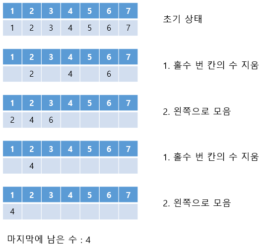
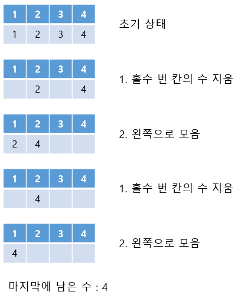

# 6주차 문제1 - 지우개

|구분|값|
|---|---|
|난이도|1|
|점수|1|
|출처|https://www.acmicpc.net/problem/21756|

## 문제 설명
`n`개의 칸에 1부터 `n`까지의 수들이 왼쪽에서부터 순서대로 저장되어 있습니다. 각 칸은 왼쪽부터 1부터 `n`까지 번호가 붙어 있습니다. 즉, 처음에는 각 칸의 번호와 각 칸에 적힌 수가 같습니다.

이 수들을 아래와 같은 방법으로 마지막으로 하나의 수가 남을 때까지 반복해서 지우려고 합니다.
1. 홀수 번 칸의 수들을 모두 지웁니다.
2. 남은 수들을 왼쪽으로 모읍니다.

즉, `n = 7`일 경우 아래와 같은 방법으로 지울 수 있습니다.



전체 칸의 수 `n`이 주어질 때, 마지막에 남은 수를 출력하는 프로그램을 만들어주세요.


## 제한 사항
- 1 ≤ n ≤ 2,000,000,000

## 입력
첫째 줄에 n이 주어집니다.

## 출력
첫째 줄에 마지막에 남은 수를 출력합니다.

## 예시
### 예시1
**입력**
```
7
```

**출력**
```
4
```

**설명**

문제의 예시와 같습니다.


### 예시2
**입력**
```
1
```

**출력**
```
1
```

**설명**

1 밖에 없기 때문에 지우지 않고 1을 출력합니다.


### 예시3
**입력**
```
4
```

**출력**
```
4
```

**설명**


