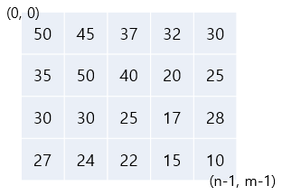
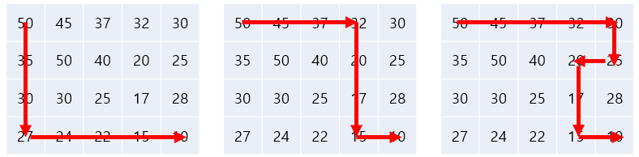
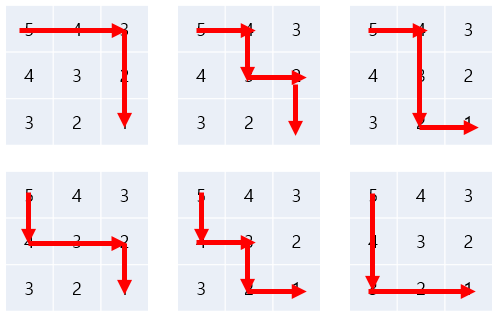

# 6주차 문제3 - 내리막길

|구분|값|
|---|---|
|난이도|3|
|점수|3|
|출처|https://www.acmicpc.net/problem/1520|

## 문제 설명
방학을 맞아 여행을 떠난 `정지호`는 세로 크기가 `n`, 가로 크기가 `m`인 직사각형 지도를 하나 구하였습니다. 이 지도는 아래 그림과 같이 직사각형 모양이며 여러 칸으로 나뉘어져 있습니다. 한 칸은 한 지점을 나타내고, 각 칸에는 그 지점의 높이가 써있습니다. 각 지점 사이의 이동은 지도에서 상하좌우 이웃한 곳끼리만 가능합니다.



위 그림과 같이 지도의 맨 위 맨 왼쪽 칸의 좌표를 `(0, 0)`으로 하고, 맨 오른쪽 맨 아래의 좌표를 `(n-1, m-1)` 이라고 할 때, 정지호는 현재 `(0, 0)` 좌표에 위치하고 있습니다.

다만 가능한 힘을 적게 들이며 이동하기 위해 항상 높이가 더 낮은 지점으로만 이동하여 `(n-1, m-1)` 위치까지 가려고 합니다. 위 지도의 경우 아래 3가지 경로가 가능합니다.



지도의 세로 크기 `n`, 지도의 가로 크기 `m`, 지도의 각 지점의 높이가 담긴 배열 `map`이 주어질 때, `(0, 0)`에서 `(n-1, m-1)`까지 내리막길만을 이용해 갈 수 있는 경로의 갯수를 출력하는 프로그램을 만들어주세요.


## 제한 사항
- 1 ≤ n, m ≤ 500
- 2 ≤ n * m
- 1 ≤ map의 각 요소 ≤ 10,000
- 경로의 갯수가 20억 이하인 경우만 주어집니다.

## 입력
첫째 줄에 n, m이 주어집니다.

둘째 줄부터 map의 각 요소가 좌표에 맞게 주어집니다.

## 출력
첫째 줄에 경로의 갯수를 출력합니다.

## 예시
### 예시1
**입력**
```
4 5
50 45 37 32 30
35 50 40 20 25
30 30 25 17 28
27 24 22 15 10
```

**출력**
```
3
```

**설명**

문제의 예시와 같습니다.


### 예시2
**입력**
```
3 3
5 4 3
4 3 2
3 2 1
```

**출력**
```
6
```

**설명**

아래 6가지 방법이 가능합니다.


