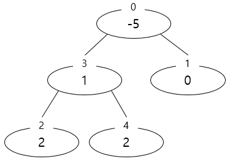
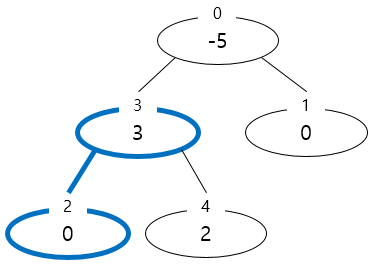
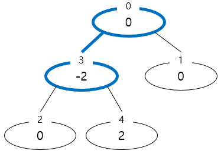
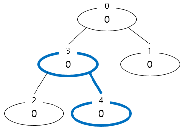
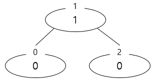

# 6주차 문제4 - 모두 0으로 만들기

|구분|값|
|---|---|
|난이도|3|
|점수|3|
|출처|https://programmers.co.kr/learn/courses/30/lessons/76503|

## 문제 설명
각 노드에 가중치가 부여된 트리가 주어집니다. 다음 연산을 통하여 이 트리의 모든 노드들의 가중치를 0으로 만들고자 합니다.

> 임의의 연결된 두 노드를 골라 한쪽은 1 증가시키고, 다른 한 쪽은 1 감소시킵니다.

하지만, 모든 트리가 위 연산을 통하여 모든 노드들의 가중치를 0으로 만들 수 있는 것은 아닙니다. 따라서 주어진 트리에 대하여 해당 사항이 가능한지를 판별하고, 가능하다면 최소한의 연산을 통하여 모든 노드들의 가중치를 0으로 만들고자 합니다.

예를 들어, 아래와 같은 트리가 있다고 해봅시다.



3번 노드와 2번 노드를 2번 연산하면 아래와 같이 변합니다.



0번 노드와 3번 노드를 5번 연산하면 아래와 같이 변합니다.



3번 노드와 4번 노드를 2번 연산하면 아래와 같이 변합니다.



최종적으로 모든 노드의 가중치가 0이 됩니다. 이때 사용한 연산의 횟수는 9가 되며, 9번의 연산이 최소한의 연산임을 쉽게 알 수 있습니다.

트리의 노드의 갯수 `n`, 각 노드에 적힌 가중치가 담긴 배열 `a`, 트리의 간선 연결 정보가 담긴 배열 `edges`가 주어질 때, 모든 노드들의 가중치를 0으로 만드는 최소한의 연산의 갯수를 구하는 프로그램을 만들어주세요.


## 제한 사항
- 2 ≤ n ≤ 200,000
- edges의 크기 = n - 1
- -10,000 ≤ a의 각 요소 ≤ 10,000
- edges의 각 요소는 `u`와 `v`로 주어져 있으며, 이는 u번 노드와 v번 노드가 연결되어 있음을 의미합니다.
- edges가 나타내는 그래프는 항상 트리 구조입니다.
- 최소 연산의 갯수(출력값) ≤ 2,000,000,000

## 입력
첫째 줄에 n이 주어집니다.

둘째 줄에 a의 각 요소가 주어집니다.

셋째 줄부터 edges가 한 줄에 하나씩 주어집니다.

## 출력
첫째 줄에 최소한의 연산의 갯수를 출력합니다. 단, 모든 노드들의 가중치를 0으로 만드는 연산의 방법이 존재하지 않는다면 -1을 출력합니다.

## 예시
### 예시1
**입력**
```
5
-5 0 2 1 2
0 1
3 4
2 3
0 3
```

**출력**
```
9
```

**설명**

문제의 예시와 같습니다.


### 예시2
**입력**
```
3
0 1 0
0 1
1 2
```

**출력**
```
-1
```

**설명**

트리 상태가 아래 그림과 같습니다.



이 트리는 모든 노드를 0으로 만드는 것이 불가능합니다.
