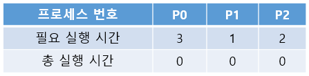
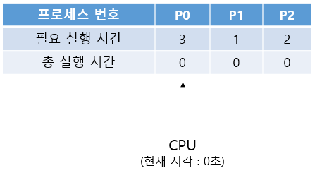
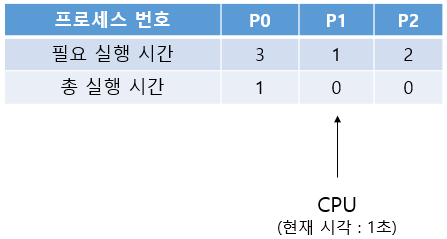
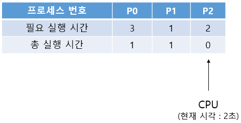
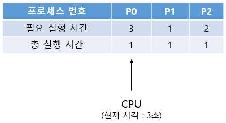
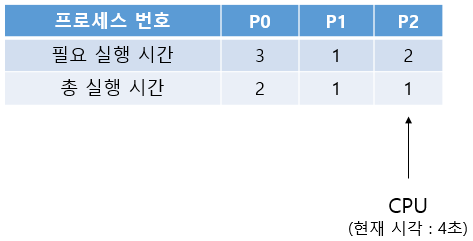
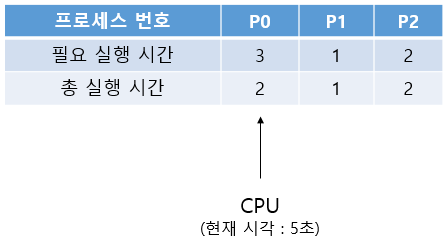

# 6주차 문제5 - 라운드로빈

|구분|값|
|---|---|
|난이도|4|
|점수|4|
|출처|https://programmers.co.kr/learn/courses/30/lessons/42891|

## 문제 설명
`나혜원`은 운영체제 수업 과제로 라운드로빈 스케쥴링을 구현하였습니다. 라운드로빈 스케쥴링은 CPU에게 프로세스를 일정 시간동안 할당한 후 다른 프로세스를 실행하도록 해주는 스케쥴링 방법입니다. `n`개의 프로세스 1초 주기로 실행한다고 할 때 구체적인 동작 방법은 아래와 같습니다.

- `0`번 프로세스부터 실행하여 `n - 1`번 프로세스까지 순서대로 1초 동안 실행합니다. 이후 다시 처음(0번)으로 돌아갑니다.
- 필요 실행 시간만큼 실행된 프로세스는 스킵되어 다음 프로세스를 실행합니다.
- 프로세스를 선택하거나 변경하는데 걸리는 오버헤드 시간은 없다고 가정합니다.

예를 들어, 아래와 같은 프로세스가 있다고 합시다.



프로세스는 `P0` → `P1` → `P2` → `P0` → ... 와 같이 원형으로 순서대로 실행됩니다.

각 초마다의 실행 상태를 확인해보겠습니다. 0초에는 P0이 실행됩니다.



1초가 되면 P0의 총 실행 시간이 1 증가하며, 다음 프로세스인 P1로 이동합니다.



2초에도 마찬가지로 동작합니다.



3초에는 P2가 마지막 프로세스이므로 맨 처음인 P0으로 돌아옵니다.



4초에는 P1의 필요 실행 시간이 모두 충족되었으므로 P1을 스킵하고 P2로 이동합니다.



5초에는 P2가 마지막 프로세스이므로 맨 처음인 P0으로 돌아옵니다.



이 방법대로 라운드로빈 스케쥴링을 수행할 때, `k`초에는 어떤 프로세스를 실행할지를 알아보려고 합니다.

프로세스의 갯수 `n`, 제한 시간 `k`, 각 프로세스의 필요 실행 시간 `processes`가 주어질 때, `k`초에 실행할 프로세스의 번호를 출력하는 프로그램을 만들어주세요.


## 제한 사항
- 1 ≤ n ≤ 200,000
- 1 ≤ k ≤ 20,000,000,000,000
- 1 ≤ processes의 각 요소 ≤ 100,000,000

## 입력
첫째 줄에 n, k가 주어집니다.

둘째 줄에 processes가 하나씩 주어집니다.

## 출력
첫째 줄에 k초에 실행할 프로세스의 번호를 출력합니다. 단, 실행할 프로세스가 없는 경우 -1을 출력합니다.

## 예시
### 예시1
**입력**
```
3 5
3 1 2
```

**출력**
```
0
```

**설명**

문제의 예시와 같습니다.


### 예시2
**입력**
```
3 6
3 1 2
```

**출력**
```
-1
```

**설명**

문제의 예시에서 6초가 되었을 때 모든 프로세스가 필요 실행 시간이 충족되어 더이상 실행할 프로세스가 없습니다.
