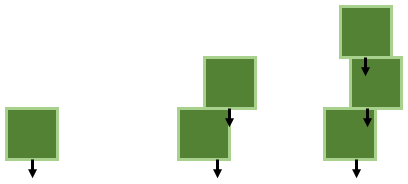
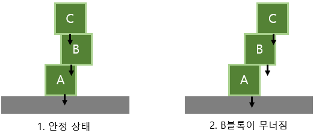
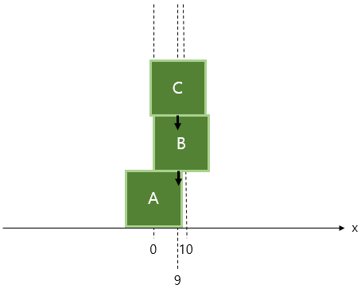
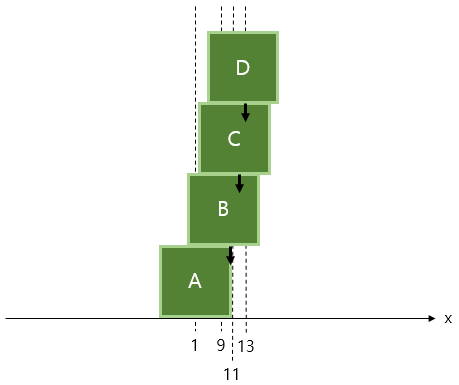
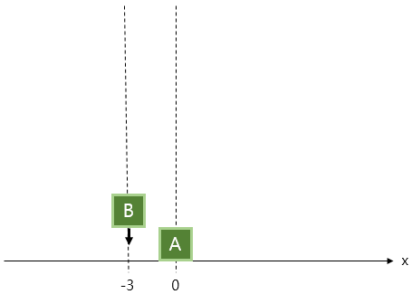

# 7주차 문제1 - 젠가

|구분|값|
|---|---|
|난이도|1|
|점수|1|
|출처|https://www.acmicpc.net/problem/20116|

## 문제 설명
보드게임을 좋아하는 `장예원`은 특이한 규칙이 있는 젠가 게임을 발견했습니다.

이 젠가 게임은 총 `n`개의 넓이가 `2m x 2m`인 정사각형 모양의 블록을 아래에서부터 하나씩 쌓아가는 게임입니다. 만약 블록을 위로 쌓다가 블록들이 무너지면 패배하게 됩니다.


각 블록은 밀도가 균일하기 때문에 각 블록의 무게 중심은 정 중앙 아래이며, 여러 블록의 무게 중심은 각 블록의 무게 중심의 평균 값입니다.



이 게임을 이기기 위해서는 블록들이 무너지지 않으면서 최대한 상대방이 블록을 놓기 불편하도록 만들어야 합니다. 따라서 블록들이 무너지는 조건을 잘 알아야 합니다.

각 블록들은 본인의 무게 중심이 바로 아래 블록의 크기를 벗어날 때 무너집니다. 반대로 말하면, 본인 블록의 윗블록들의 무게 중심의 합이 본인 블록의 크기를 벗어난다면 윗블록들은 무너집니다.



1. 모든 무게 중심들이 본인 아래 블록의 크기 안에 있어 안정 상태입니다.
2. C블록에 의해 B블록의 무게 중심이 오른쪽으로 쏠리게 되었고, B블록의 무게 중심이 A블록의 범위를 넘어가 B블록이 무너집니다.

장예원은 이 게임을 전략적으로 분석하기 위해 젠가 시뮬레이션을 만드려고 합니다.

블록의 갯수 `n`, 각 블록의 길이의 절반 `m`, 각 블록들의 중심 좌표 `blocks`가 주어질 때, 블록들이 무너지는지 여부를 출력하는 프로그램을 만들어주세요.

## 제한 사항
- 1 ≤ n ≤ 200,000
- 1 ≤ m ≤ 1,000,000,000
- -1,000,000,000 ≤ blocks의 각 요소 ≤ 1,000,000,000
- 무게 중심이 아래 블록의 모서리에 딱 걸쳐 있는 경우(같은 경우) 무너지는 것으로 합니다.

## 입력
첫째 줄에 n, m이 주어집니다.

둘째 줄에 blocks가 하나씩 주어집니다.

## 출력
첫째 줄에 무너지는 경우 0, 무너지지 않는 경우 1을 출력합니다.

## 예시
### 예시1
**입력**
```
3 10
0 10 9
```

**출력**
```
1
```

**설명**



- C의 무게 중심은 `9`이고, 이는 B의 구간인 `(0, 20)`에 속합니다.
- B의 무게 중심은 `(10+9)/2 = 9.5`이고, 이는 A의 구간인 `(-10, 10)`에 속합니다.

모든 블록이 무너지지 않았으므로 1을 출력합니다.


### 예시2
**입력**
```
4 10
1 9 11 13
```

**출력**
```
0
```

**설명**



- D의 무게 중심은 `13`이고, 이는 C의 구간인 `(1, 21)`에 속합니다.
- C의 무게 중심은 `(13+11)/2 = 12`이고, 이는 B의 구간인 `(-1, 19)`에 속합니다.
- B의 무게 중심은 `(13+11+9)/3 = 11`이고, 이는 A의 구간인 `(-9, 11)`에 딱 걸치므로 조건에 따라 무너집니다.

무너진 블록이 있으므로 0을 출력합니다.


### 예시3
**입력**
```
2 1
0 -3
```

**출력**
```
0
```

**설명**



- B의 무게 중심은 `-3`이고, 이는 A의 구간인 `(-1, 1)`에 속하지 않아 무너집니다.

