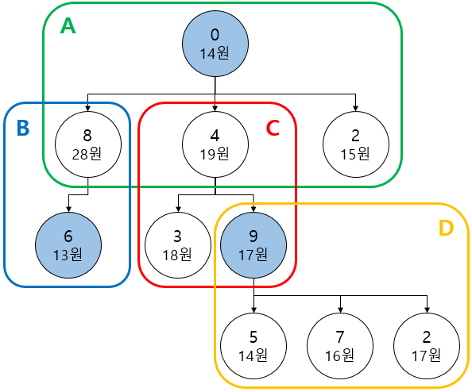
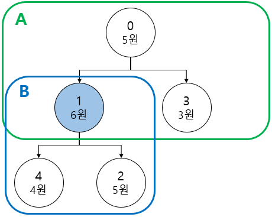
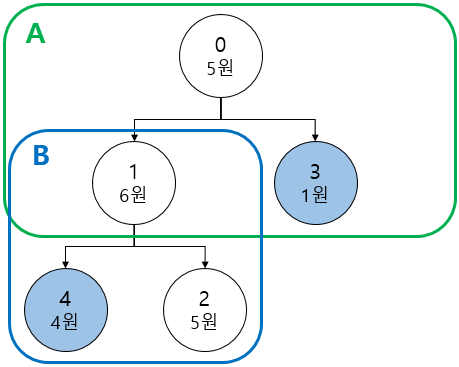
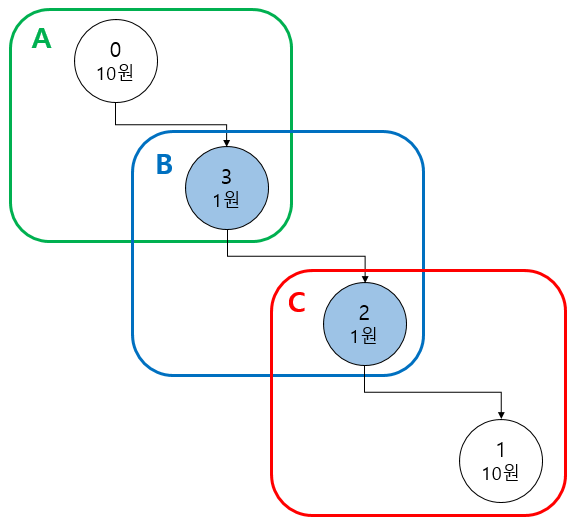

# 7주차 문제5 - 디닷컴 주식회사

|구분|값|
|---|---|
|난이도|4|
|점수|4|
|출처|https://programmers.co.kr/learn/courses/30/lessons/72416|

## 문제 설명
디닷컴 동아리의 새로운 사업이 크게 성공하여 `디닷컴 주식회사`가 설립되었습니다.

디닷컴 주식회사는 직원들을 여러 개의 팀 단위로 조직을 구성하고 있으며, 아래 그림은 CEO를 포함하여 10명의 직원과 4개의 팀으로 구성되어 있는 회사 조직도를 보여주고 있습니다.



그림의 조직도는 다음과 같이 설명할 수 있습니다.

1. 그림의 각 원들은 각각의 직원 한 명을 표시하고 있으며, CEO를 포함해 총 10명의 직원이 나타납니다.
2. 각 원 안에 있는 숫자는 `직원 번호`와 해당 직원의 `하루 매출액`을 나타냅니다. 직원 번호는 `0번` 부터 순서대로 발급되는 일련번호입니다. 위 그림에서 0번 직원은 14원을, 8번 직원은 28원의 매출액을 기록하고 있습니다.
3. CEO를 포함한 모든 직원은 팀장 또는 팀원의 직책을 가지고 있습니다. 그림에는 팀장과 팀원의 관계를 트리 구조로 나타냈습니다. 화살표가 시작되는 쪽의 직원은 팀장, 화살표를 받는 쪽의 직원은 팀원입니다.
    1. 직원 번호 `0번`은 항상 CEO로 고정되어 있고, CEO는 항상 팀장이고 팀원이 될 수 없습니다. (즉, 트리의 루트에 속합니다.)
    2. CEO를 제외한 직원들은 다른 누군가는 정확히 한 명의 팀장 밑에 소속되어 있습니다. (즉, 정확히 한 명에게 화살표를 받습니다.)
    3. 한 직원은 최대 2개의 팀에 소속될 수 있습니다. 단, 2개의 팀에 소속된 경우 한 팀에서는 팀장, 다른 한 팀에서는 팀원이어야 합니다. 둘다 팀장이거나 둘다 팀원일 수 없습니다. 예를 들어, `9번` 직원은 `D팀`의 팀장이면서 동시에 `4번` 직원이 팀장으로 있는 `C팀`에 속한 팀원입니다. `4번` 직원과 `8번` 직원도 마찬가지입니다.
    4. `1번`, `2번`, `3번`, `5번`, `6번`, `7번` 직원은 말단(리프)에 위치하므로 항상 팀원입니다.
    5. 그림의 조직도에는 `A`, `B`, `C`, `D` 총 4개의 팀이 존재하며, 각각 `0번`, `8번`, `4번`, `9번` 직원이 팀장 직위를 담당합니다.

디닷컴 주식회사는 하루 일정으로 워크숍을 계획하고 있습니다. 단, 모든 직원을 참석시킬 수 없어 아래와 같은 기준으로 워크숍에 참석할 직원들을 선발하려고 합니다.

1. 워크숍 내용이 모든 팀에게 공유되도록 하기 위해 모든 팀은 최소 1명 이상의 직원을 워크숍에 참석시켜야 합니다.
2. 워크숍 기간 동안 회사의 매출 손실을 최소화하기 위해 워크숍에 참석하는 직원들의 하루 매출액의 합이 최소가 되어야 합니다.

그림의 조직도에서는 색칠된 `0번`, `6번`, `9번` 직원을 워크숍에 참석시키면 모든 팀에서 최소 한 명 이상의 직원을 참석시키며, 하루 매출액의 합은 `44(14+13+17)원`로 최소가 됩니다. 이때, `9번` 직원은 `C팀`과 `D팀` 모두에 속해있으므로, 두 팀에서 모두 참석한 것으로 인정됩니다.

총 직원의 수 `n`, 직원들의 하루 매출액을 담은 배열 `sales`, 직원들의 팀장-팀원 관계를 담은 배열 `links`가 주어질 때, 주어진 조건대로 워크숍 참석한 직원들의 하루 매출액의 합이 최소를 구하는 프로그램을 만들어주세요.


## 제한 사항
- 2 ≤ n ≤ 300,000
- 0 ≤ sales의 각 요소 ≤ 10,000
- sales는 0번부터 차례대로 주어집니다.
- links의 크기 = n - 1
- links는 각각 `팀장번호 팀원번호`으로 구성되어 있습니다.
- 0 ≤ 하루 매출의 합의 최소(출력 값) ≤ 2^31 - 1

## 입력
첫째 줄에 n이 주어집니다.

둘째 줄에 sales가 하나씩 주어집니다.

셋째 줄부터 links가 한 줄에 하나씩 주어집니다.

## 출력
첫째 줄에 워크숍에 참석한 직원들의 하루 매출의 합의 최소를 출력합니다.

## 예시
### 예시1
**입력**
```
10
14 17 15 18 19 14 13 16 28 17
9 7
0 8
8 6
4 3
0 4
4 9
9 5
0 2
9 1
```

**출력**
```
44
```

**설명**

문제의 예시와 같습니다.


### 예시2
**입력**
```
5
5 6 5 3 4
1 2
0 3
1 4
0 1
```

**출력**
```
6
```

**설명**




### 예시3
**입력**
```
5
5 6 5 1 4
1 2
0 3
1 4
0 1
```

**출력**
```
5
```

**설명**




### 예시4
**입력**
```
4
10 10 1 1
2 1
3 2
0 3
```

**출력**
```
2
```


