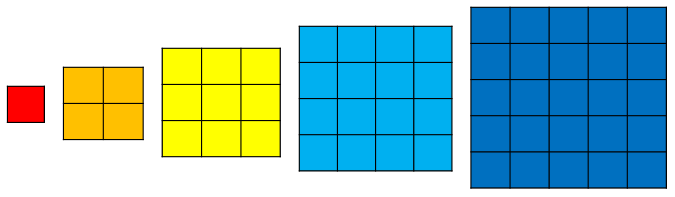
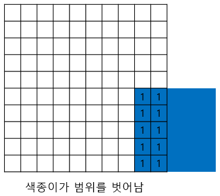
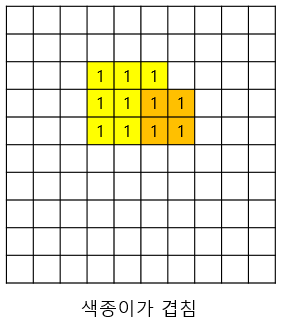
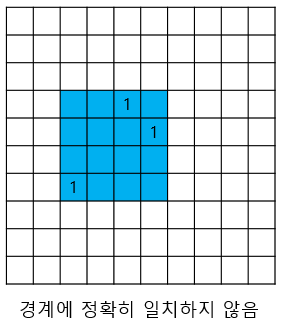
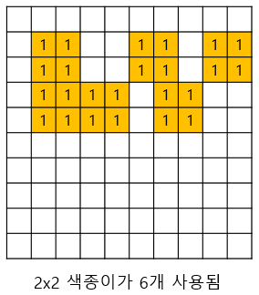

# 8주차 문제2 - 색종이 붙이기

|구분|값|
|---|---|
|난이도|3|
|점수|3|
|출처|https://www.acmicpc.net/problem/17136|

## 문제 설명
아래 그림과 같이 정사각형 모양을 한 다섯 종류의 색종이가 있습니다. 색종이의 크기는 각각 `1x1`, `2x2`, `3x3`, `4x4`, `5x5`이고, 각 종류의 색종이는 5개씩 가지고 있습니다.



색종이를 크기가 `10x10`인 종이 위에 붙이려고 합니다. 종이는 `1x1` 크기의 칸으로 나누어져 있으며, 각 칸에는 0 또는 1이 적혀있습니다. 1이 적힌 칸은 모두 색종이로 덮어져야 합니다.

색종이를 붙일 때는 아래와 같은 규칙을 따라야 합니다.

1. 색종이를 종이의 경계 밖에 나가도록 붙이지 말아야 합니다.
2. 색종이끼리 겹쳐서 붙이지 말아야 합니다.
3. 칸의 경계에 일치하게 붙여야 합니다. 즉, 0이 적힌 칸에는 색종이가 있지 않아야 합니다.
4. 색종이 갯수를 초과해서 붙일 수는 없습니다. 즉, 각 색종이별 최대 5개씩만 사용 가능합니다.

아래 그림은 각각 1, 2, 3, 4번 규칙을 위반한 사례입니다.









이 규칙대로 최대한 적은 갯수의 색종이를 사용해 종이를 덮으려고 합니다.

종이의 상태 `paper`가 주어질 때, 1이 적힌 모든 칸을 붙이는 데 필요한 색종이의 최소 갯수를 구하는 프로그램을 만들어주세요.


## 제한 사항
- paper의 각 요소 = 0 or 1

## 입력
첫째 줄부터 paper의 각 요소가 주어집니다.

## 출력
첫째 줄에 색종이의 최소 갯수를 출력합니다. 단, 종이의 1을 모두 덮는 것이 불가능하다면 -1을 출력합니다.

## 예시
### 예시1
**입력**
```
0 0 0 0 0 0 0 0 0 0
0 0 0 0 0 0 0 0 0 0
0 0 0 0 0 0 0 0 0 0
0 0 0 0 0 0 0 0 0 0
0 0 0 0 0 0 0 0 0 0
0 0 0 0 0 0 0 0 0 0
0 0 0 0 0 0 0 0 0 0
0 0 0 0 0 0 0 0 0 0
0 0 0 0 0 0 0 0 0 0
0 0 0 0 0 0 0 0 0 0
```

**출력**
```
0
```

**설명**

색종이가 필요하지 않습니다.


### 예시2
**입력**
```
0 0 0 0 0 0 0 0 0 0
0 1 0 0 0 0 0 0 0 0
0 0 0 0 0 0 0 0 0 0
0 0 0 0 1 0 0 0 0 0
0 0 0 0 0 1 0 0 0 0
0 0 0 0 0 0 0 0 0 0
0 0 1 0 0 0 0 0 0 0
0 0 0 0 0 0 0 0 0 0
0 0 0 0 0 0 0 0 0 0
0 0 0 0 0 0 0 0 0 0
```

**출력**
```
4
```

**설명**

`1x1` 4개가 필요합니다.


### 예시3
**입력**
```
0 0 0 0 0 0 0 0 0 0
0 1 1 0 0 0 0 0 0 0
0 0 1 0 0 0 0 0 0 0
0 0 0 0 1 1 0 0 0 0
0 0 0 0 1 1 0 0 0 0
0 0 0 0 0 0 0 0 0 0
0 0 1 0 0 0 0 0 0 0
0 0 0 0 0 0 0 0 0 0
0 0 0 0 0 0 0 0 0 0
0 0 0 0 0 0 0 0 0 0
```

**출력**
```
5
```

**설명**

`1x1` 4개, `2x2` 1개가 필요합니다.


### 예시4
**입력**
```
0 0 0 0 0 0 0 0 0 0
0 1 1 0 0 0 0 0 0 0
0 0 1 0 0 0 0 0 0 0
0 0 0 0 1 1 0 0 0 0
0 0 0 0 0 1 0 0 0 0
0 0 0 0 0 0 0 0 0 0
0 0 1 0 0 0 0 0 0 0
0 0 0 0 0 0 0 0 0 0
0 0 0 0 0 0 0 0 0 0
0 0 0 0 0 0 0 0 0 0
```

**출력**
```
-1
```

**설명**

모든 1을 덮는 것이 불가능합니다.


### 예시5
**입력**
```
0 0 0 0 0 0 0 0 0 0
0 1 1 0 0 0 0 0 0 0
0 1 1 1 0 0 0 0 0 0
0 0 1 1 1 1 1 0 0 0
0 0 0 1 1 1 1 0 0 0
0 0 0 0 1 1 1 0 0 0
0 0 1 0 0 0 0 0 0 0
0 0 0 0 0 0 0 0 0 0
0 0 0 0 0 0 0 0 0 0
0 0 0 0 0 0 0 0 0 0
```

**출력**
```
7
```

**설명**

`1x1` 5개, `2x2` 1개, `3x3` 1개가 필요합니다.


### 예시6
**입력**
```
1 1 1 1 1 1 1 1 1 1
1 1 1 1 1 1 1 1 1 1
1 1 1 1 1 1 1 1 1 1
1 1 1 1 1 1 1 1 1 1
1 1 1 1 1 1 1 1 1 1
1 1 1 1 1 1 1 1 1 1
1 1 1 1 1 1 1 1 1 1
1 1 1 1 1 1 1 1 1 1
1 1 1 1 1 1 1 1 1 1
1 1 1 1 1 1 1 1 1 1
```

**출력**
```
4
```

**설명**

`5x5` 4개가 필요합니다.


### 예시7
**입력**
```
0 0 0 0 0 0 0 0 0 0
0 1 1 1 1 1 0 0 0 0
0 1 1 1 1 1 0 0 0 0
0 0 1 1 1 1 0 0 0 0
0 0 1 1 1 1 0 0 0 0
0 1 1 1 1 1 1 1 1 1
0 1 1 1 0 1 1 1 1 1
0 1 1 1 0 1 1 1 1 1
0 0 0 0 0 1 1 1 1 1
0 0 0 0 0 1 1 1 1 1
```

**출력**
```
6
```

**설명**

`1x1` 2개, `3x3` 1개, `4x4` 1개, `5x5` 1개가 필요합니다.


### 예시8
**입력**
```
0 0 0 0 0 0 0 0 0 0
1 1 1 1 1 0 0 0 0 0
1 1 1 1 1 0 1 1 1 1
1 1 1 1 1 0 1 1 1 1
1 1 1 1 1 0 1 1 1 1
1 1 1 1 1 0 1 1 1 1
0 0 0 0 0 0 0 0 0 0
0 1 1 1 0 1 1 0 0 0
0 1 1 1 0 1 1 0 0 0
0 1 1 1 0 0 0 0 0 1
```

**출력**
```
5
```

**설명**

`1x1` 1개, `2x2` 1개, `3x3` 1개, `4x4` 1개, `5x5` 1개가 필요합니다.
