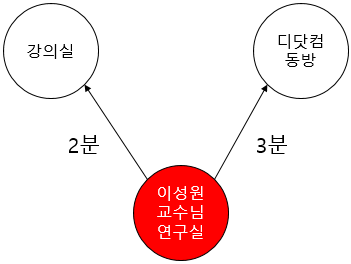
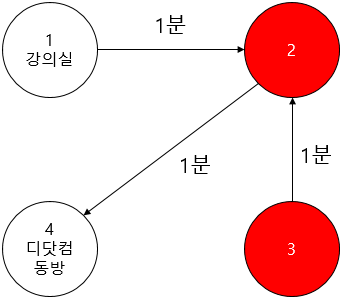

# 8주차 문제3 - 출튀

|구분|값|
|---|---|
|난이도|4|
|점수|4|
|출처|https://programmers.co.kr/learn/courses/30/lessons/81304|

## 문제 설명
수업이 너무 지루했던 `오윤석`은 출튀를 하기로 결심했습니다.

안전한 출튀를 위해서는 최대한 빠른 경로로 탈출해야 합니다. 소융대 건물의 각 방간의 연결 경로가 주어질 때, 강의실을 탈출해서 디닷컴 동방으로 가장 빠른 경로로 이동하려고 합니다.


위 그림은 소융대 건물의 각 방간의 연결 경로가 나타난 약도입니다. 위 약도에는 총 3개의 방이 있고, 방과 방 사이를 연결하는 길에는 이동하는데 걸리는 시간이 표시되어 있습니다.

길은 화살표가 가리키는 방향으로만 이동할 수 있습니다. 즉, 위 그림의 상태에서 아래 두 길만 이용할 수 있습니다.
- `강의실` → `이성원 교수님 연구실` (반대로는 불가)
- `디닷컴 동방` → `이성원 교수님 연구실` (반대로는 불가)

방들 중에는 빨간 색으로 표시된 `함정 방`이 존재합니다. 함정 방으로 이동하면 이동한 함정과 연결된 모든 화살표의 방향이 반대로 바뀝니다. 즉, 길이 아래와 같이 반대로 바뀝니다.



이 상태에서는 아래 두 길만 이용할 수 있습니다.
- `이성원 교수님 연구실` → `강의실` (반대로는 불가)
- `이성원 교수님 연구실` → `디닷컴 동방` (반대로는 불가)

즉, 출튀를 하기 위해 필요한 최단 시간은 아래와 같습니다.
- `강의실` → `이성원 교수님 연구실` (이동 시간 : 2분)
- 함정 발동 : `이성원 교수님 연구실`과 연결된 모든 길의 방향이 반대가 됩니다.
- `이성원 교수님 연구실` → `디닷컴 동방` (이동 시간 : 3분)
- 출튀에 성공하였습니다. 총 이동 시간은 5분입니다.


약도에 표시된 방의 갯수 `n`, 강의실의 번호 `start`, 디닷컴 동방의 번호 `end`, 총 길의 갯수 `m`, 길과 그 길의 이동 시간을 나타낸 배열 `roads`, 함정의 갯수 `k`, 함정 방의 번호를 나타낸 배열 `traps`가 주어질 때, 출튀를 하는데 필요한 최단 시간을 구하는 프로그램을 만들어주세요.


## 제한 사항
- 2 ≤ n ≤ 1,000
- 1 ≤ m ≤ 3,000
- 0 ≤ k ≤ 10
- 1 ≤ start ≤ n
- 1 ≤ end ≤ n
- start ≠ end (디닷컴 동방은 강의실이 아닙니다.)
- roads의 각 요소는 `p`, `q`, `t`로 이루어져 있습니다.
    - `p`에서 `q`로 갈 수 있는 길이 있으며, 이동 시간은 `t`입니다.
    - 1 ≤ p ≤ n
    - 1 ≤ q ≤ n
    - p ≠ q
    - 1 ≤ t ≤ 3,000
    - 서로 다른 두 방 사이의 직접 연결된 길이 여러 개 존재할 수 있습니다.
- 1 ≤ traps의 각 요소 ≤ n
- 강의실과 디닷컴 동방은 함정이 아닙니다.
- 똑같은 함정을 두 번 방문하면 다시 원래 방향의 길로 돌아옵니다. 즉, 길만 있다면 여러 번 방문하여 계속 방향을 반대로 뒤집을 수 있습니다.

## 입력
첫째 줄에 n, m, k, start, end가 주어집니다.

둘째 줄에 traps가 하나씩 주어집니다.

셋째 줄부터 roads가 하나씩 주어집니다.

## 출력
첫째 줄에 출튀를 하는데 필요한 최단 시간을 출력합니다. 단, 출튀를 할 수 있는 경로가 없다면 -1을 출력합니다.

## 예시
### 예시1
**입력**
```
3 2 1 1 3
2
1 2 2
3 2 3
```

**출력**
```
5
```

**설명**

문제의 예시와 같습니다.


### 예시2
**입력**
```
4 3 2 1 4
2 3
1 2 1
3 2 1
2 4 1
```

**출력**
```
4
```

**설명**



1 → 2 → 3 → 2 → 4 순서로 이동합니다.
